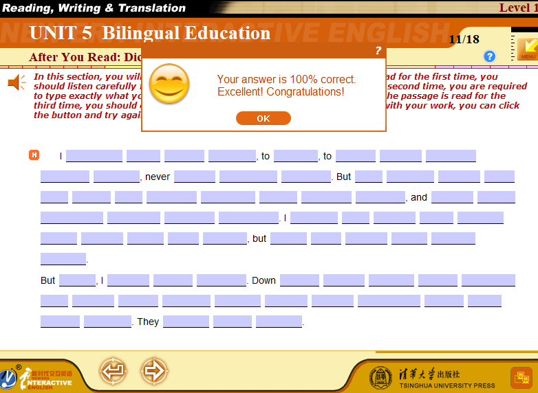
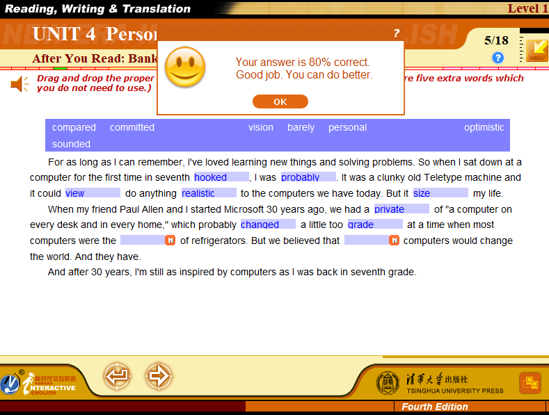
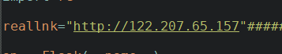
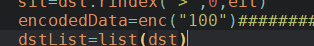
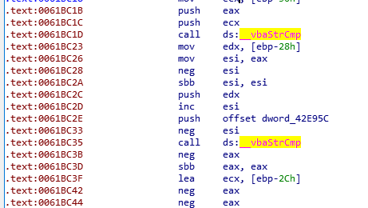

# 读写译本地改包脚本现在开放测试辣！

# 如果你愿意使用本脚本，代表你愿意为由此导致的一切后果负责

## 依赖库

+ requests

+ flask

## 功能特性

+ 遇到70%分数限制的题目直接submit可以满分通过（拖曳单词题目不拖还是0分，但是乱拖拖满就是满分）
+ 其他没有分数限制的题目直接submit提示0分，但是服务器上会显示满分





## 使用教程

1. [下载](#资源)并安装官方客户端程序，一切照着步骤走，下载完成后最好备份安装目录下散装文件，文件夹（如Data,Binaries等）不用备份。

2. 将本仓库的[魔改读写译客户端](RWTLevel1_Win10.exe)放入安装目录，与本体程序放一起。

3. 修改```Data/remote.ip.txt```文件，如果没有就新建一个，改成如下内容：
```
[Server]
ServerIP=127.0.0.1
```

4. 确保python3已经安装，依赖库如果没装可以通过cmd命令```pip install requests flask```来安装，然后下载本仓库中[NEIEModifyScoreServer.py](NEIEModifyScoreServer.py)

5. 配置NEIEModifyScoreServer.py中长井号标识的地方，如

此处改成学校提供的真实ip，



此处改成想要改的分数，注意引号内请填70~100之间的数字，否则会产生不可意料的后果。

确保你的80端口没被其他网页服务器如apache,nginx,caddy等占用，然后双击运行NEIEModifyScoreServer.py。

6. 运行魔改版客户端。

## 技术原理

客户端与服务器直接大概会交流这三类信息：


视听说就比较直白了，每道题完成后都会直接把成绩上传到服务器，不会有70%分数限制，何况视听说有[现成的脚本](https://github.com/ranulldd/NEIE-Assistant)。

这样一来我们其实可以考虑在程序向服务器报告成绩时，把它的数据包拦截住然后修改，再将它发送至服务器。关于这一点burp就做得到。


但是读写译恶心就恶心在它有一些题目它判断你没有达到70%的分数时，它直接叫你重做，而不是向服务器报告。


所以我们即使想要改成满分发上服务器，我们也至少要拿到70分才能用如上方法实现。

而逆向后的程序把这样的规则破坏了，程序会以为我们把题目都做对了。但是本仓库内逆向处理后的程序如果没有受70%限制的题目依然会把真实成绩报告给服务器。为了让正课成绩不受影响，我们需要本地的代理来修改成绩。而NEIEModifyScoreServer.py就是做这个的，这也是为什么你需要把remote.ip.txt改为127.0.0.1，即本地。


其它与成绩无关的数据包，我们直接让它从py搭建的服务器上双向转发就好。

## 折腾记录

[屑站专栏](https://www.bilibili.com/read/cv3815100)

这一段是写给有一定基础的逆向人员看的。

之前是因为win10上视听说安装完成以后打不开才开始做的，那时候简单做了个跳过软件依赖检测的效果，在本仓库里也顺便[发出来了](VLSLevel1_Win10.exe)。

而读写译的破解，要重点跟踪两个函数，一个是__vbaTstEq，这个函数管判断对象是否相等（影响填空题和听写题），另一个是__vbaStrCmp，判断字符串是否相等（影响拖入单词题）。对于前者，找出关键跳进行nop填充或者改成jmp无条件跳转可破，专栏里有说。关键是后者，程序里的逻辑比较奇怪，我的修改思路是把0061BC1B位置的push传eax的值为参数直接改成ecx，但这样避不开下面那个比较判断是否空串。



另外在这里留个未完成的坑：005FB0E0地址附近是圆圈互斥单选题的判断逻辑，观察后发现里面有两个__vbaTstEq，并且对于每个选择都会在代码块内进行5次__vbaTstEq，猜想第一次判断是否空选，第二次开始如果是错误选项，会在地址数字比较小的__vbaTstEq进行判断（即判断你是否选择了错误选项）然后如果是正确选项，会在地址数字比较大的地方进行同样的判断（即判断你是否选择了正解）。这里应该可以修改代码达到单选题直接满分的效果，但是考虑到它并没有在70%这里设坎，我用了本地服务器改包来实现修改分数。

最后，听写题和填空题的代码块内，存在jugdement和weightscore这两个字符串，一开始就去查找它们的话可以少走很多弯路。

## 后记

这些东西都是基于课余的兴趣去学习研究的，并且没有盈利意向。

目前只有Level1的版本，其他Level会在不远的将来放出。~~在做了在做了~~

逆向后的两个程序目前只在win10，i7-6700HQ下进行过测试，由于汇编移植性问题，推荐其它平台不能正常运行的小伙伴自己按照文章进行破解。

如果读写译程序卡住，请确保py窗口没有进入选择状态，选择状态下的窗口会被阻塞，可以通过右键单击来解除（其实这样做的操作是粘贴）。

仓库内附带的[enc.py](enc.py)是加解密工具。打开后输入密文输出明文，反之输入明文则输出密文。

请不要大范围的宣传本工具。~~中国有句老话叫什么？~~

如果有其他问题，欢迎到Issues区开帖。

本工具集根据```Anti 996 LICENSE```开源，在任何情况下，版权持有人均不对任何后果负责。

## 资源

官方的视听说读写译全4级的安装包链接：

[x8wg](https://pan.baidu.com/s/1Gwt6KM0MRZI2RoSRI8E4fg )

## 工具推荐

+ burp suite
+ OllyDbg
+ IDA